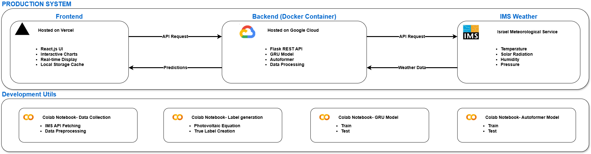

# Solar Panel Output Prediction Using ML With Weather Data

A machine learning-based solar energy forecasting system that predicts photovoltaic power output using real-time weather data from the Israel Meteorological Service.

## Overview

This capstone project implements a dual-architecture forecasting system:
- **GRU Model**: Short-term forecasting (24 hours ahead)
- **Autoformer Model**: Long-term forecasting (up to 96 hours ahead)

The system achieves high accuracy rates of 86.32% (GRU) and 91.50% (Autoformer) using a 15% tolerance threshold, making it suitable for both operational planning and strategic energy management.

## Live Application

🌐 **[Try it here](https://solar-forecast-frontend.vercel.app/)**

## Key Features

- Real-time weather data integration from IMS API
- Interactive web interface for forecast visualization
- Dual prediction models optimized for different time horizons
- Production-ready deployment with React frontend and Flask backend

## System Architecture

The system is divided into two main layers: Production System and Development Utilities.

The Production System consists of:
- **React.js Frontend** (Vercel) - User interface and visualization
- **Flask REST API Backend** (Google Cloud Run) - Model serving and predictions
- **IMS Weather API** - Real-time meteorological data
- **ML Models** - GRU and Autoformer for forecasting

## Tech Stack

**Frontend**: React.js, Chart.js, Bootstrap  
**Backend**: Python, Flask, Keras, TensorFlow, PyTorch, Docker  
**Deployment**: Vercel (frontend), Google Cloud Run (backend)

## Installation & Usage

For detailed installation instructions, system architecture, and usage guidelines, please refer to the [Phase B Documentation](documents/Solar_Panel_Output_Prediction_Using_ML_With_Weather_Data_Paper_Phase_B.pdf) in this repository.

## Performance

| Model | Success Rate | MAE of Misses |
|-------|--------------|---------------|
| GRU (24h) | 86.32% | 86.83W |
| Autoformer (96h) | 91.50% | 68.24W |

## Team

**Students**: Yovel Jirad & Shay Pinsky  
**Supervisors**: Dr. Dan Lemberg & Mrs. Elena Kramer  
**Institution**: Braude College of Engineering  
**Project Code**: 25-2-D-3

This project was developed as part of a capstone project at Braude College of Engineering (2025-2026).
